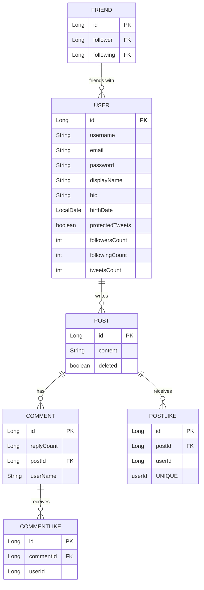

## 목차
1. [Commit Message Convention](#commit-message-convention)
2. [Wireframe](#wireframe)
3. [Erd](#erd)
4. [API 명세서](#api-명세서)
    1. [1. 사용자(User) API](#1-사용자user-api)
    2. [2. 게시글(Post) API](#2-게시글post-api)
    3. [3. 댓글(Comment) API](#3-댓글comment-api)
    4. [4. 친구(Comment) API](#4-친구friend-api)
    5. [5. 좋아요(Like) API](#5-좋아요like-api)

# Commit Message Convention

### 1.1 사용자 생성
```
타입은 태그와 제목으로 구성되고, 태그는 영어로 쓰되 첫 문자는 대문자로 한다.
태그 : 제목의 형태이며, :뒤에만 space가 있음에 유의한다.
내용은 간단하게 영어로 작성

feat : 새로운 기능 추가 
fix : 버그 수정 
docs : 문서 수정 
style : 코드 포맷팅, 세미콜론 누락, 코드 변경이 없는 경우 
refactor : 코드 리펙토링 
test : 테스트 코드, 리펙토링 테스트 코드 추가 
chore : 빌드 업무 수정, 패키지 매니저 수정
```

# Wireframe


# ERD



# API 명세서
## 401은 global 설정 예정입니다.

## 1. 사용자(User) API

### 1.1 사용자 생성
- **POST** `/api/users`
- **Request Body**:
    ```json
    {
      "username": "string",
      "email": "string",
      "password": "string",
      "displayName": "string",
      "bio": "string",
      "birthDate": "YYYY-MM-DD",
      "protectedTweets": "boolean"
    }
    ```
- **Response**:
    - **201 Created**: 생성된 사용자 정보
    - **400 Bad Request**: 유효하지 않은 입력

### 1.2 사용자 조회
- **GET** `/api/users/{id}`
- **Response**:
    - **200 OK**: 사용자 정보
    - **404 Not Found**: 사용자가 존재하지 않음

### 1.3 사용자 업데이트
- **PUT** `/api/users/{id}`
- **Request Body**:
    ```json
    {
      "displayName": "string",
      "bio": "string",
      "protectedTweets": "boolean"
    }
    ```
- **Response**:
    - **200 OK**: 업데이트된 사용자 정보
    - **404 Not Found**: 사용자가 존재하지 않음

### 1.4 사용자 삭제
- **DELETE** `/api/users/{id}`
- **Response**:
    - **204 No Content**: 삭제 성공
    - **404 Not Found**: 사용자가 존재하지 않음

### 1.5 비밀번호 변경
- **PUT** `/api/password/{id}`
- **Request Body**:
    ```json
    {
      "password": "string",
    }
    ```
- **Response**:
    - **204 No Content**: 패스워드 변경 성공
    - **403 Not Found**: 사용자의 비밀번호가 다름

---

## 2. 게시글(Post) API

### 2.1 게시글 생성
- **POST** `/api/posts`
- **Request Body**:
    ```json
    {
      "content": "string",
      "userId": "Long"
    }
    ```
- **Response**:
    - **201 Created**: 생성된 게시글 정보
    - **400 Bad Request**: 유효하지 않은 입력

### 2.2 게시글 조회
- **GET** `/api/posts/{id}`
- **Response**:
    - **200 OK**: 게시글 정보
    - **404 Not Found**: 게시글이 존재하지 않음

### 2.3 게시글 업데이트
- **PUT** `/api/posts/{id}`
- **Request Body**:
    ```json
    {
      "content": "string"
    }
    ```
- **Response**:
    - **200 OK**: 업데이트된 게시글 정보
    - **404 Not Found**: 게시글이 존재하지 않음

### 2.4 게시글 삭제
- **DELETE** `/api/posts/{id}`
- **Response**:
    - **204 No Content**: 삭제 성공
    - **404 Not Found**: 게시글이 존재하지 않음

---

## 3. 댓글(Comment) API

### 3.1 댓글 생성
- **POST** `/api/comments`
- **Request Body**:
    ```json
    {
      "postId": "Long",
      "userName": "string",
      "replyCount": 0
    }
    ```
- **Response**:
    - **201 Created**: 생성된 댓글 정보
    - **400 Bad Request**: 유효하지 않은 입력

### 3.2 댓글 조회
- **GET** `/api/comments/{id}`
- **Response**:
    - **200 OK**: 댓글 정보
    - **404 Not Found**: 댓글이 존재하지 않음

### 3.3 댓글 업데이트
- **PUT** `/api/comments/{id}`
- **Request Body**:
    ```json
    {
      "replyCount": "Long"
    }
    ```
- **Response**:
    - **200 OK**: 업데이트된 댓글 정보
    - **404 Not Found**: 댓글이 존재하지 않음

### 3.4 댓글 삭제
- **DELETE** `/api/comments/{id}`
- **Response**:
    - **204 No Content**: 삭제 성공
    - **404 Not Found**: 댓글이 존재하지 않음

---

## 4. 친구(Friend) API

### 4.1 친구 관계 생성
- **POST** `/api/follow`
- **Request Body**:
    ```json
    {
      "id": "Long" 
    }
    ```
- **Response**:
    - **201 Created**: 생성된 친구 관계 정보
    - **400 Bad Request**: 유효하지 않은 입력
    - **404 Not Found**: 사용자 중 하나가 존재하지 않음

### 4.2 내가 팔로우하는 사용자 조회
- **GET** `/api/follow/following`
- **Response**:
    - **200 OK**: 내가 팔로우하는 사용자 목록
    - **Content**:
    ```json
    {
      "followingUsers": [
        {
          "follower": { "id": "Long", "name": "string" },
          "following": { "id": "Long", "name": "string" }
        }
      ]
    }
    ```
    - **404 Not Found**: 팔로우하는 사용자가 존재하지 않음

### 4.3 나를 팔로우하는 사용자 조회
- **GET** `/api/follow/follower`
- **Response**:
    - **200 OK**: 나를 팔로우하는 사용자 목록
    - **Content**:
    ```json
    {
      "followers": [
        {
          "follower": { "id": "Long", "name": "string" },
          "following": { "id": "Long", "name": "string" }
        }
      ]
    }
    ```
    - **404 Not Found**: 나를 팔로우하는 사용자가 존재하지 않음

### 4.4 친구 관계 삭제
- **DELETE** `/api/follow`
- **Request Header**:
    - `Authorization`: 팔로우할 사용자의 ID
- **Response**:
    - **204 No Content**: 삭제 성공
    - **404 Not Found**: 친구 관계가 존재하지 않음
---

## 5. 좋아요(Like) API

### 5.1 게시글 좋아요 생성
- **POST** `/api/postlikes`
- **Request Body**:
    ```json
    {
      "postId": "Long"
    }
    ```
- **Response**:
    - **201 Created**: 생성된 좋아요 정보
    - **400 Bad Request**: 유효하지 않은 입력

### 5.2 댓글 좋아요 생성
- **POST** `/api/commentlikes`
- **Request Body**:
    ```json
    {
      "commentId": "Long"
    }
    ```
- **Response**:
    - **201 Created**: 생성된 좋아요 정보
    - **400 Bad Request**: 유효하지 않은 입력

### 5.3 좋아요 삭제
- **DELETE** `/api/postlikes/{id}`
- **Response**:
    - **204 No Content**: 삭제 성공
    - **403 Not Found**: 내가 만든 좋아요가 아닌 경우
    - **404 Not Found**: 좋아요가 존재하지 않음

### 5.4 댓글 좋아요 삭제
- **DELETE** `/api/commentlikes/{id}`
- **Response**:
    - **204 No Content**: 삭제 성공
    - **403 Not Found**: 내가 만든 좋아요가 아닌 경우
    - **404 Not Found**: 좋아요가 존재하지 않음
