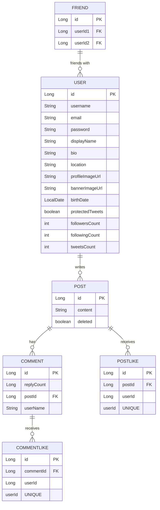

# Commit Message Convention

```
타입은 태그와 제목으로 구성되고, 태그는 영어로 쓰되 첫 문자는 대문자로 한다.
태그 : 제목의 형태이며, :뒤에만 space가 있음에 유의한다.
내용은 간단하게 영어로 작성

Feat : 새로운 기능 추가 
Fix : 버그 수정 
Docs : 문서 수정 
Style : 코드 포맷팅, 세미콜론 누락, 코드 변경이 없는 경우 
Refactor : 코드 리펙토링 
Test : 테스트 코드, 리펙토링 테스트 코드 추가 
Chore : 빌드 업무 수정, 패키지 매니저 수정
```

# ERD


